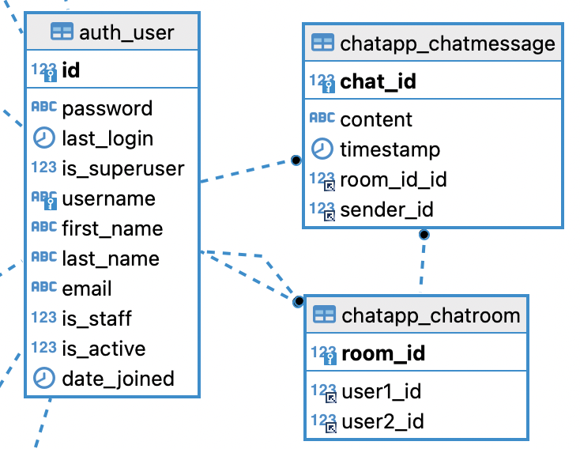
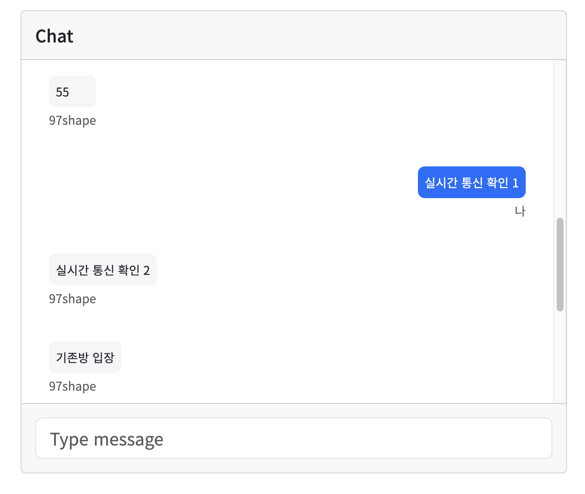

# Django 채팅방 구현하기
##### mac 환경에서 구현되었습니다.
## 2. 1대 1 채팅방 만들기
### <b>데이터 베이스 구성</b>
####  <b>chatapp/models.py</b>
``` python
from django.contrib.auth import get_user_model
from django.db import models

User = get_user_model()

class ChatRoom(models.Model):
    room_id = models.AutoField(primary_key=True);
    user1 = models.ForeignKey(User, on_delete=models.CASCADE, related_name='room_user1')
    user2 = models.ForeignKey(User, on_delete=models.CASCADE, related_name='room_user2')

class ChatMessage(models.Model):
    chat_id = models.AutoField(primary_key=True);
    room_id = models.ForeignKey(ChatRoom, on_delete=models.CASCADE)
    content = models.TextField()
    sender = models.ForeignKey(User, on_delete=models.CASCADE)
    timestamp = models.DateTimeField(auto_now_add=True)
```

### <b>DB</b>


ChatRoom 테이블에서는 1 대 1 채팅의 유저 id를 외래키로
ChatMessage 테이블에서는 보낸 유저의 id와 채팅방 id를 외래키로 사용합니다.

### <b>코드</b>
#### **chatapp/counsumers.py**
```python
class ChatConsumer(AsyncWebsocketConsumer):
    async def connect(self):
        self.room_id = self.scope['url_route']['kwargs'].get('room_name')  # room_name으로 유지
        if self.room_id:
            try:
                chat_room = await sync_to_async(ChatRoom.objects.get)(room_id=self.room_id)
                self.room_id = chat_room.room_id  # room_id를 ChatRoom의 id로 업데이트
                await self.channel_layer.group_add(
                    str(self.room_id),  # 그룹 이름을 문자열로 변경
                    self.channel_name
                )
                await self.accept()

                await self.send_existing_messages()

            except ChatRoom.DoesNotExist:
                # 처리할 로직 추가
                await self.close()
        else:
            # room_id가 없는 경우 처리 로직 추가
            await self.close()

    async def disconnect(self, close_code):
        if self.room_id:
            await self.channel_layer.group_discard(
                str(self.room_id),  # 그룹 이름을 문자열로 변경
                self.channel_name
            )

    async def send_existing_messages(self):
        try:
            chat_room = await sync_to_async(ChatRoom.objects.get)(room_id=self.room_id)  # room_id로 조회
        except ChatRoom.DoesNotExist:
            # 처리할 로직 추가
            return

        messages = await sync_to_async(list)(ChatMessage.objects.filter(room_id=chat_room))
        for message in messages:
            # 유저 이름을 동적으로 처리해줌
            sender_username = await sync_to_async(lambda: message.sender.username if message.sender else None)()
            await self.send(text_data=json.dumps({
                'message': message.content,
                'sender': sender_username
            }))

    async def receive(self, text_data):
        text_data_json = json.loads(text_data)
        message = text_data_json['message']
        sender = self.scope['user']

        # Save the chat message to the database
        try:
            chat_room = await sync_to_async(ChatRoom.objects.get)(room_id=self.room_id)# room_id로 조회
        except ChatRoom.DoesNotExist:
            # 처리할 로직 추가
            return

        await sync_to_async(ChatMessage.objects.create)(
            room_id=chat_room,
            content=message,
            sender=sender
        )

        # Send message to room group
        await self.channel_layer.group_send(
            str(self.room_id),  # 그룹 이름을 문자열로 변경
            {
                'type': 'chat_message',
                'message': message,
                'sender': sender.username
            }
        )

    async def chat_message(self, event):
        message = event['message']
        sender = event['sender']

        # Send message to WebSocket
        await self.send(text_data=json.dumps({
            'message': message,
            'sender': sender
        }))
```
기존 코드에서 DB를 활용할 수 있도록 변경해주었다.

#### <b>chatapp/views.py</b>

**채팅방 목록 불러오기**
```python
@login_required(login_url='/account/need_login')
def room_list(request):
    # or문
    rooms = ChatRoom.objects.filter(user1_id=request.user.id) | ChatRoom.objects.filter(user2_id=request.user.id)

    rooms = rooms.annotate(
        last_message=Subquery(
            ChatMessage.objects.filter(room_id=OuterRef('room_id')).order_by('-timestamp').values('content')[:1]
        )
    )
    return render(request, "room_list.html", {"rooms": rooms})
```
request.user.id, 즉 로그인한 사용자가 참여하고 있는 채팅방을 데이터 베이스에서 찾고 rooms에 저장합니다.\
그렇게 찾은 채팅방에서 마지막 메시지를 가져오기 위해 annotate를 이용해서 가져와준 뒤 반환해준다.

<b>채팅방 만들기</b>
```python
def create_chatroom(request, writer_id):
    user1 = request.user
    user2 = User.objects.get(id=writer_id)  # post를 통해서 상대방 정보 받아오기
    chat_room = ChatRoom.objects.create(user1=user1, user2=user2)
    
    return redirect(reverse('room', kwargs={'room_id': chat_room.pk}))
```
여기서는 당근 마켓처럼 게시판에서 채팅을 걸 수 있도록 게시글 작성자의 id(writer_id)를 불러왔다.
create를 사용했을 때 생성되는 정보를 chat_room에 담고 pk값, 즉 room_id를 추출한다.


**메시지 송/수신**
```python
def send_message(request, room_id):
    chat_room = ChatRoom.objects.get(id=room_id)
    if request.method == 'POST':
        form = SendMessageForm(request.POST)
        if form.is_valid():
            content = form.cleaned_data['content']
            sender = request.user
            ChatMessage.objects.create(room=chat_room, content=content, sender=sender)
            return redirect('room', room_id=room_id)
    else:
        form = SendMessageForm()
    messages = get_chat_messages(room_id)
    return render(request, 'room.html', {'form': form, 'messages': messages})

def get_chat_messages(room_id):
    messages = ChatMessage.objects.filter(room_id=room_id).order_by('timestamp')
    return messages
```

**채팅방 참가**
``` python
def chatroom_create_or_join(request, writer_id):
    # 채팅방이 이미 존재하는지 확인
    chatrooms = ChatRoom.objects.filter(
        Q(user1_id=request.user.id, user2_id=writer_id) | Q(user1_id=writer_id, user2_id=request.user.id) #Q를 이용해서 표현 가능
    )

    # 채팅방이 존재하는 경우 해당 채팅방으로 이동
    if chatrooms:
        return redirect(reverse('room', kwargs={'room_id': chatrooms.first().room_id}))
    else:
        # 채팅방이 존재하지 않는 경우, 채팅방 생성 후 해당 채팅방으로 이동
        return create_chatroom(request, writer_id)
```
이 코드는 게시글에서 채팅 참가를 눌렀을 때, 이미 있는 채팅방이라면 참가하지 않도록 설계되었다.

**채팅 내역 가져오기**
```python
def chatroom_detail(request, room_id):
    chat_room = ChatRoom.objects.get(room_id=room_id)
    messages = ChatMessage.objects.filter(chat_id=room_id)

    return render(request, 'room.html', {
        'room_id': room_id,
        'messages': messages,
        'chat_room': chat_room
    })
```

#### **templates**
**채팅창**
```js
var room_id = '{{ room_id }}';
var chatSocket = new WebSocket((window.location.protocol === 'https:' ? 'wss://' : 'ws://') + window.location.host + '/ws/chat/' + room_id + '/');

chatSocket.onmessage = function(e) {
    var data = JSON.parse(e.data);
    var message = data['message'];
    var sender = data['sender'];

    // 지금 접속한 사용자 인가?
    var currentUser = '{{ request.user }}';
    var isCurrentUser = sender === currentUser;

    // Display the message
    var newMessage
    if (isCurrentUser) {
        var newMessage = `
            <div class="d-flex flex-row justify-content-end mb-4 pt-1">
                <div>
                    <p class="small p-2 me-3 mb-1 text-white rounded-3 bg-primary">${message}</p>
                    <p class="small ms-3 me-3 rounded-3 text-muted d-flex justify-content-end">나</p>
                </div>
            </div>
        `;
    } else {
        var newMessage = `
            <div class="d-flex flex-row justify-content-start mb-4">
                <div>
                    <p class="small p-2 ms-3 mb-1 rounded-3" style="background-color: #f5f6f7;">${message}</p>
                    <p class="small ms-3 mb-3 rounded-3 text-muted">${sender}</p>
                </div>
            </div>
    `;
    }
    $('#chat-log').append(newMessage);
};

$(document).ready(function() {
    $('#chat-message-input').on('keypress', function(event) {
        if (event.keyCode === 13) {  // Enter key
            event.preventDefault();
            var messageInputDom = $('#chat-message-input');
            var message = messageInputDom.val();

            // Send the message
            chatSocket.send(JSON.stringify({
                'room_id': room_id,
                'message': message
            }));

            messageInputDom.val('');
        }
    });
});
```
chatSocket 객체를 생성해서 해당하는 room_id의 Websocket경로에 연결합니다.\
이를 chatSocket.onmessage 이벤트 헨들러로 새로운 메시지를 받을 때 마다 메시지를 보낸 사람에 따라서 출력해주는 코드를 실행햐게 만들었습니다.

또한 `$(document).ready(function()`내부에 `$('#chat-message-input').on('keypress', function(event)`를 이용해서 메시지를 작성 후 버튼이 아닌 enterkey가 눌렀을 때 메시지가 전송하도록 구현했다.


전체 코드 : https://github.com/97-shape/GNU_LOST